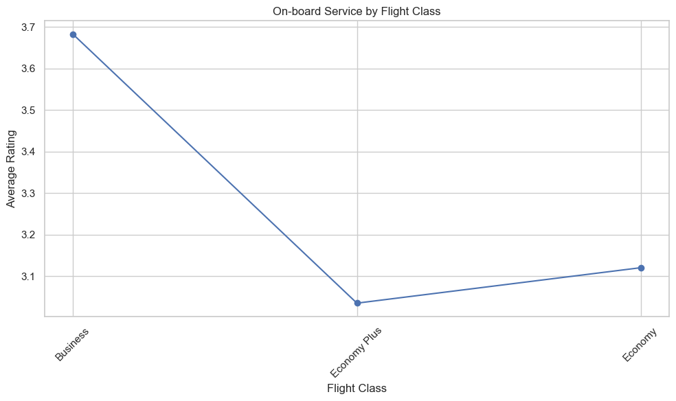

# Enhancing Airline Passenger Satisfaction: Data-driven Insights for Superior Travel Experiences.

## Getting you up to speed :

### If you've ever wondered what makes airline passengers truly happy, you're in for a treat. 
### This project is all about digging into a bunch of data about how travelers feel about their flights. My plan? 
### To use some cool tech skills to figure out what things matter most to passengers, from looking at stuff like how long flights are, to checking if delays annoy folks, I'll be using my data analysis superpowers to unravel the secrets of happy flyers. 
### So buckle up, as we dive into this data adventure to help airlines make your next trip even more awesome!

#### First, let's import the required libraries 


```python
import numpy as np 
import pandas as pd
import warnings
warnings.filterwarnings("ignore", category=FutureWarning)
import pandas as pd
import matplotlib.pyplot as plt
import seaborn as sns

```


```python
pd.read_csv("Datasets\Airline+Passenger+Satisfaction/airline_passenger_satisfaction.csv")

airline_data = pd.read_csv("Datasets\Airline+Passenger+Satisfaction/airline_passenger_satisfaction.csv")

```

#### Dealing with missing values 


```python
airline_data.dropna(inplace=True)

```

#### Now that the data looks clean, it is indeed ready to answer analytical questions

### How is passenger satisfaction distributed across different gender groups?

#### We can answer this by analyzing the satisfaction levels for female and male passengers and see if there are any notable differences.


```python
# Group data by Gender and Satisfaction, and count occurrences

passenger_satisfaction = airline_data.groupby(['Gender', 'Satisfaction']).size().unstack()

# Creating a bar plot
passenger_satisfaction.plot(kind='bar', stacked=False)

# Customizing the plot
plt.title('Passenger Satisfaction by Gender')
plt.xlabel('Gender')
plt.ylabel('Count')
plt.xticks(rotation=0)
plt.legend(title='Satisfaction')

# Display the plot
plt.tight_layout()
plt.show()

```


    

    


### Does age affect overall passenger satisfaction?

#### We can group passengers by age ranges and compare their overall satisfaction levels to see if there's a correlation.


```python
# Define age ranges
age_bins = [0, 18, 30, 50, 100]
age_labels = ['0-18', '19-30', '31-50', '51+']

# Add a new column 'age_range' to the DataFrame based on age bins
airline_data['age_range'] = pd.cut(airline_data['Age'], bins=age_bins, labels=age_labels, right=False)

airline_data['Satisfied'] = airline_data['Satisfaction'] == 'Satisfied'
airline_data['Unsatisfied'] = airline_data['Satisfaction'] == 'Neutral or Dissatisfied'

# Group by age_range and calculate the count of 'Satisfied' occurrences for each group
age_satisfaction = airline_data.groupby('age_range')[['Satisfied', 'Unsatisfied']].sum()

# Plot using matplotlib
plt.figure(figsize=(10, 6))
age_satisfaction.plot(kind='bar', stacked=True)
plt.title('Satisfaction by Age Range')
plt.xlabel('Age Range')
plt.ylabel('Count')
plt.xticks(rotation=0)
plt.legend(['Satisfied', 'Unsatisfied'])

plt.show()

```


    <Figure size 1000x600 with 0 Axes>


    

    


### Are returning customers generally more satisfied than first-time customers?

#### We can compare the satisfaction levels of returning and first-time customers to understand if loyalty affects satisfaction.


```python
# Classifying first-time customers and returning ones.
returning_customers = airline_data[airline_data['Customer Type'] == 'Returning']
first_time_customers = airline_data[airline_data['Customer Type'] == 'First-time']

# Calculate average satisfaction levels for returning and first-time customers
avg_satisfaction_returning = returning_customers['Satisfied'].mean()
avg_satisfaction_first_time = first_time_customers['Satisfied'].mean()

# Data for plotting
categories = ['Returning Customers', 'First-time Customers']
satisfaction_levels = [avg_satisfaction_returning, avg_satisfaction_first_time]

# Create a bar plot
plt.bar(categories, satisfaction_levels, color=['green', 'red'])
plt.xlabel('Customer Type')
plt.ylabel('Average Satisfaction Level')
plt.title('Average Satisfaction Levels for Returning and First-time Customers')
plt.ylim(0, 2) 
plt.show()
```


    

    


```python
# Perform a t-test to check if the difference is statistically significant
from scipy.stats import ttest_ind

t_statistic, p_value = ttest_ind(returning_customers['Satisfied'], first_time_customers['Satisfied'])

if p_value < 0.05:
    print("The difference in satisfaction levels is statistically significant.")
else:
    print("The difference in satisfaction levels is not statistically significant.")
```

    The difference in satisfaction levels is statistically significant.
    

### Is there a difference in satisfaction levels between business and personal travelers?

####  We will analyze whether passengers on business trips have different satisfaction levels compared to those traveling for personal reasons.


```python
# Group data by 'Travel_Type' and calculate the mean satisfaction for each group

satisfaction_by_type = airline_data.groupby('Type of Travel')[['Satisfied','Unsatisfied']].mean().round(2)

# Plot the mean satisfaction by travel type
satisfaction_by_type.plot(kind='bar', figsize=(10, 6))
plt.title('Average Satisfaction by Travel Type')
plt.xlabel('Type of Travel')
plt.ylabel('Avg Satisfaction')
plt.legend(title='Satisfaction')
plt.xticks(rotation=0)
plt.show()

```


    

    


### Which travel class has the highest satisfaction rating?

#### We will investigate which travel class (e.g., Economy, Business, First) receives the highest satisfaction ratings.


```python
# Calculate the average satisfaction rating for each travel class

average_satisfaction_by_class = airline_data.groupby('Class')['Satisfied'].mean()

# Find the travel class with the highest average satisfaction

highest_satisfaction_class = average_satisfaction_by_class.idxmax()


highest_satisfaction_value = average_satisfaction_by_class.round(2).max()

# Create a new DataFrame to display the result

satifaction_by_class = pd.DataFrame({
    'Travel Class': [highest_satisfaction_class],
    'Highest Satisfaction Rating': [highest_satisfaction_value]
})

# Create a line chart to visualize the average satisfaction rating for each travel class
plt.figure(figsize=(10, 6))
average_satisfaction_by_class.plot(marker='o')
plt.title('Average Satisfaction Rating by Travel Class')
plt.xlabel('Travel Class')
plt.ylabel('Average Satisfaction Rating')
plt.grid(False)
plt.xticks(rotation=45)
plt.tight_layout()
plt.show()
```


    

    


### Do longer flight distances have a direct effect with lower satisfaction levels?

#### We could determine if passengers on longer flights tend to have lower satisfaction scores compared to those on shorter flights.


```python
# Convert 'Flight Distance' column to numeric type

dtype={'Flight Distance': float}

# Calculate the average satisfaction score for different distance ranges

distance_bins = [0, 500, 1000, 1500, 2000]  
distance_labels = ['<500', '500-1000', '1000-1500', '1500+']

airline_data['Flight Distance'] = pd.cut(airline_data['Flight Distance'], bins=distance_bins, labels=distance_labels)
average_satisfaction_by_distance = airline_data.groupby('Flight Distance')[['Unsatisfied']].mean()

# Set the style of the plot
sns.set(style="whitegrid")

# Create a bar plot using Seaborn
plt.figure(figsize=(10, 6))
sns.barplot(x=average_satisfaction_by_distance.index, y='Unsatisfied', data=average_satisfaction_by_distance, palette="viridis")

# Set labels and title
plt.xlabel("Flight Distance Range")
plt.ylabel("Average Satisfaction Score")
plt.title("Average Satisfaction by Flight Distance Range")

# Show the plot
plt.show()
```


    

    


### How do different aspects of the travel experience (e.g., cleanliness, food, entertainment) contribute to overall satisfaction?

####   We will break down the satisfaction scores for various aspects of the flight to see which factors have the most impact on overall satisfaction.


```python
# Creating a new dataframe that only displays data about the travel experience 

# List of columns selected
selected_columns = [
    'Cleanliness',
    'Food and Drink',
    'In-flight Entertainment',
    'Seat Comfort',
    'Leg Room Service',
    'In-flight Service',
    'In-flight Wifi Service',
    'Online Boarding',
    'Ease of Online Booking',
    'Departure and Arrival Time Convenience',
    'On-board Service',
     'Check-in Service',
    'Baggage Handling',
    'Gate Location'
    
]

travel_experience = airline_data[selected_columns]

# Group by Flight Type and calculate mean for each aspect

travel_experience_by_class = travel_experience.groupby(airline_data['Class']).mean()

# Calculate the overall satisfaction for each row (axis=1 means calculate across columns)

travel_experience_by_class['Overall Satisfaction'] = travel_experience_by_class.mean(axis=1)

# Sort by the overall satisfaction in descending order

travel_experience_by_class = travel_experience_by_class.sort_values(
    by=[
    'Cleanliness',
    'Food and Drink',
    'In-flight Entertainment',
    'Seat Comfort',
    'Leg Room Service',
    'In-flight Service',
    'In-flight Wifi Service',
    'Online Boarding',
    'Ease of Online Booking',
    'Departure and Arrival Time Convenience',
    'On-board Service',
     'Check-in Service',
    'Baggage Handling',
    'Gate Location'
    
],
    ascending=False
)

# Rearrange columns to have 'Overall Satisfaction' as the first column

column_order = ['Overall Satisfaction'] + selected_columns
travel_experience_by_class = travel_experience_by_class[column_order]

# Loop through each aspect and create a line chart
for aspect in selected_columns:
    plt.figure(figsize=(10, 6))
    plt.plot(travel_experience_by_class.index, travel_experience_by_class[aspect], marker='o')
    plt.title(f'{aspect} by Flight Class')
    plt.xlabel('Flight Class')
    plt.ylabel('Average Rating')
    plt.xticks(rotation=45)
    plt.grid(True)
    plt.tight_layout()
    plt.show()
```


    

    


    

    


    

    


    

    


    

    


    

    


    

    


    

    


    

    


    

    


    

    


    

    


    

    


    

    


### Is there a relationship between departure delay and passenger satisfaction?

#### Let's explore whether longer departure delays are associated with lower satisfaction ratings.


```python
# Calculate average satisfaction for different departure delay ranges
  
airline_data['Departure Delay Range in minutes'] = pd.cut(airline_data['Departure Delay'], 
                                         
                                         bins=[-np.inf, 10, 20, np.inf], labels=['<10', '10-20', '>20'])

average_satisfaction_by_delay = airline_data.groupby('Departure Delay Range in minutes')[['Satisfied']].mean()

# Convert the result to a DataFrame for easier plotting
average_satisfaction_df = average_satisfaction_by_delay.reset_index()

# Create a bar plot
plt.figure(figsize=(8, 6))
plt.bar(average_satisfaction_df['Departure Delay Range in minutes'], average_satisfaction_df['Satisfied'])
plt.xlabel('Departure Delay Range in minutes')
plt.ylabel('Average Satisfaction')
plt.title('Average Satisfaction by Departure Delay Range')
plt.show()


```


    

    


### Does the satisfaction with online services (booking, check-in, boarding) impact overall satisfaction?

#### We can analyze how satisfaction with online services affects the overall satisfaction level of passengers.


```python
# import pandas as pd

# List of columns related to online services
online_services = [
    'Online Boarding',
    'Ease of Online Booking',
    'Check-in Service'
]

# Create a new DataFrame with selected columns
online_services_experience = airline_data[online_services]

# Calculate the mean overall satisfaction for each level of online service satisfaction
overall_satisfaction_mean = airline_data.groupby('Gender')[['Online Boarding', 'Ease of Online Booking', 'Check-in Service' ]].mean().reset_index()


# Calculate the overall satisfaction for each row (axis=1 means calculate across columns)

overall_satisfaction_mean['Overall Satisfaction'] = overall_satisfaction_mean.mean(axis=1)

# Melt the DataFrame to create a tidy format for visualization
melted_data = pd.melt(overall_satisfaction_mean, id_vars='Gender', value_vars=['Online Boarding', 'Ease of Online Booking', 'Check-in Service'])

# Create a grouped bar plot using seaborn
plt.figure(figsize=(10, 6))
sns.barplot(data=melted_data, x='Gender', y='value', hue='variable', palette='Set2')
plt.title("Mean Satisfaction for Online Services by Gender")
plt.xlabel("Gender")
plt.ylabel("Mean Satisfaction")
plt.legend(title='Online Service')
plt.show()
```


    

    

